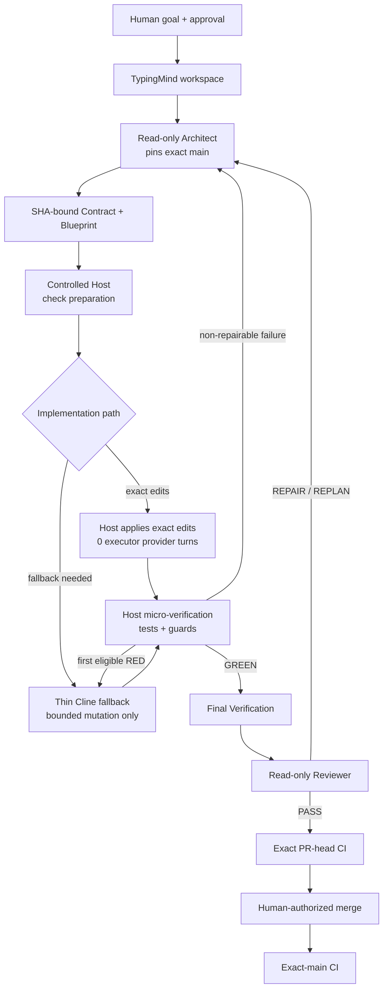
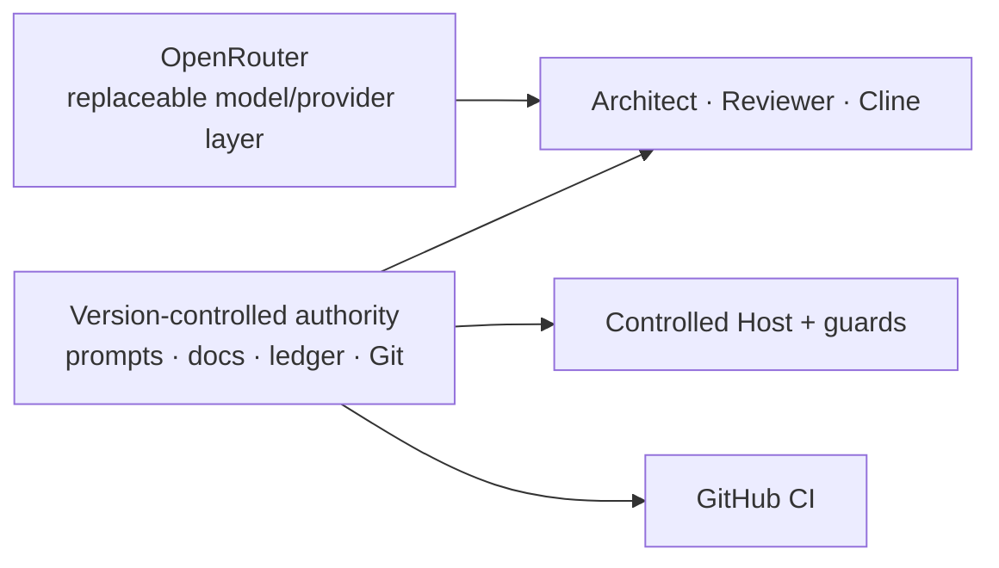

# AI-Assisted Development Workflow

[](https://github.com/wintersyntax/ai-assisted-development-workflow/actions/workflows/ci.yml)

[](LICENSE)

> **Active work in progress.** This repository documents an experimental software-development workflow that I am actively using and refining while building real projects. It is not presented as a finished framework or a universal best practice.

A portable, guardrailed workflow for AI-assisted software development, designed around **durable project memory, model flexibility, bounded implementation and cost-aware execution**.

## Why this exists

AI-assisted development is powerful, but many workflows become dependent on one chat session, one model subscription, or one tool's internal memory. That creates practical limits around context, cost, availability and reproducibility.

This project explores a more portable approach:

- keep project memory, decisions and handoff state in version-controlled documents;
- use replaceable model/provider boundaries instead of tying the workflow to one subscription;
- spend stronger reasoning models where they add the most value;
- give implementation agents narrow, explicit contracts rather than the whole project;
- use deterministic tests, guards and CI as completion authority;
- preserve a durable ledger so work can continue across sessions, tools and models.

The goal is not maximum autonomy. It is **more control over context, documents, cost, time and change** while still benefiting from strong AI models where they are most useful.

## High-level architecture

### Development path



The main path is intentionally linear: **solve → prepare → apply → verify → review → integrate**. The only implementation branch is whether the Host can apply Architect-written exact edits directly or must invoke the thin Cline fallback.

### Supporting layers



These layers stay deliberately separate: **the repository owns durable state and policy; OpenRouter only supplies replaceable model access**. Neither chat history nor a model provider becomes the source of truth.

OpenRouter is a **model/provider boundary**, not another agent. TypingMind is the planning/review workspace, the controlled Host owns execution and verification, and Cline is only the bounded fallback when a solved change cannot be applied deterministically.

## Core ideas

### Repository-owned prompts and durable project memory

Chat context is convenient but ephemeral. Specs, prompts, handoffs, ledgers, decisions, acceptance criteria and repair evidence live in version-controlled files so the project does not depend on one session retaining everything.

TypingMind keeps only a small stable bootstrap; current role instructions are loaded from exact repository state. See [Documentation authority](docs/DOCUMENTATION_AUTHORITY.md) and [Ledger system](docs/LEDGER_SYSTEM.md).

### Model flexibility, time and cost control

The workflow is intentionally not tied to one AI subscription or one model. OpenRouter can route different roles to different models depending on capability, latency, availability and cost.

The current design also reduces model spend by preferring Architect-written exact edits: when a slice is fully specified, the Host can apply it with **0 executor provider turns**. See [Model, time and cost strategy](docs/MODEL_AND_COST_STRATEGY.md).

### Contract + multi-slice Blueprint

The planning layer solves the task against one exact `BASE_MAIN_SHA` and produces a versioned Contract plus ordered execution Blueprint.

The Contract defines objective, non-goals, authorized/relevant paths, invariants, acceptance, verification, stop conditions and risks. Blueprint slices define exact changes, mutation targets, Architect-authored regression tests, preservation rules and focused verification.

See [Handoff contract](docs/HANDOFF_CONTRACT.md) and the [sanitised example](examples/architect-handoff.example.json).

### Fail-closed repair

A failed checkpoint does not automatically authorize broader edits. The workflow stops, inspects the failure, creates a focused repair handoff, and retests the bounded scope.

### Deterministic completion authority

An AI agent saying "done" is not completion evidence. Tests, schema validation, checkpoint rules and CI decide whether the implementation satisfies the contract.

## Current scope

This repository currently focuses on:

- TypingMind as the human-facing planning/review workspace;
- repository-owned Architect/Reviewer prompts loaded from exact current state;
- OpenRouter as a replaceable model/provider layer;
- SHA-bound Contract + multi-slice Blueprint handoffs;
- a controlled Host for preparation, exact edits and verification;
- thin Cline fallback only where deterministic execution is insufficient;
- a Markdown do-not-forget ledger;
- fail-closed checkpoint and repair rules;
- local-first verification plus exact-ref CI evidence;
- sanitised case studies from real project work.

The workflow is still evolving. Automatic Architect → Host → Reviewer transport remains future work; the human is still an explicit coordination, spending and merge authority.

## Repository layout

```text
README.md
LICENSE
docs/
  ARCHITECTURE.md
  WORKFLOW.md
  AGENT_ROLES.md
  DOCUMENTATION_AUTHORITY.md
  MODEL_AND_COST_STRATEGY.md
  HANDOFF_CONTRACT.md
  LEDGER_SYSTEM.md
  CHECKPOINTS_AND_REPAIR.md
  CI_CD.md
  CASE_STUDY.md
schemas/
  handoff.schema.json
examples/
  architect-handoff.example.json
  do-not-forget-ledger.example.md
  repair-loop.example.md
scripts/
  validate_workflow.py
.github/workflows/
  ci.yml
  release.yml
assets/
```

## Development approach

This workflow is itself being developed through **AI-assisted iteration**. AI models participate in architecture exploration, implementation, review and repair. Human direction remains responsible for project goals, scope, acceptance criteria, risk decisions and final merges.

The point of the project is not to hide AI involvement, but to make it **more inspectable, portable and controllable**.

## Status

**Active work in progress.** The current version is being extracted and generalised from workflows used on real software projects. Public examples are synthetic or sanitised; private credentials, deployment values and proprietary project content are not included.

## License

MIT — see [LICENSE](LICENSE).
