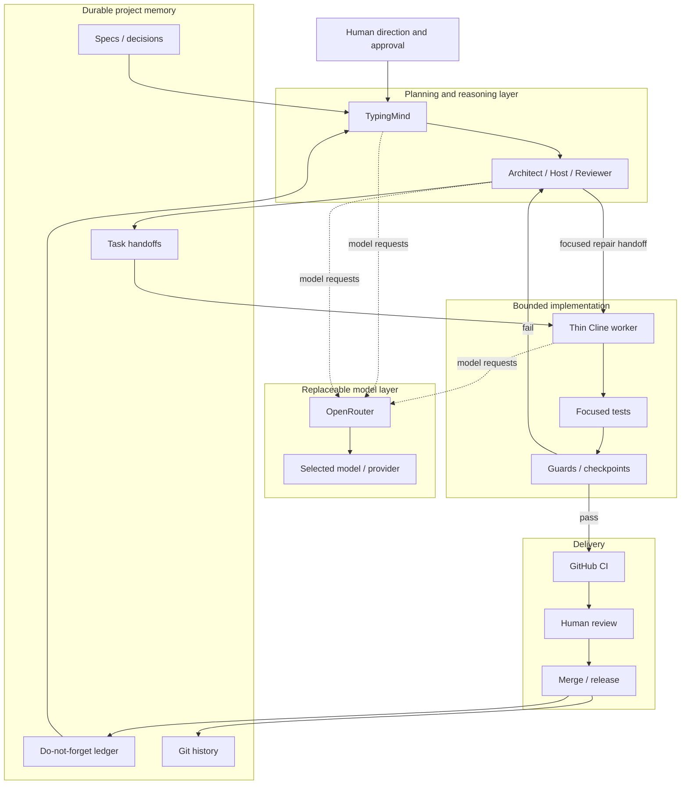

# AI-Assisted Development Workflow

> **Active work in progress.** This repository documents an experimental software-development workflow that I am actively using and refining while building real projects. It is not presented as a finished framework or a universal best practice.

A portable, guardrailed workflow for AI-assisted software development, designed around **durable project memory, model flexibility, bounded implementation and cost-aware execution**.

## Why this exists

AI-assisted development is powerful, but many workflows become dependent on one chat session, one model subscription, or one tool's internal memory. That creates practical limits around context, cost, availability and reproducibility.

This project explores a more portable approach:

- keep project memory, decisions and handoff state in version-controlled documents;
- use replaceable model/provider boundaries instead of tying the workflow to one subscription;
- spend stronger reasoning models where they add the most value;
- give implementation agents narrow, explicit contracts rather than the whole project;
- use deterministic tests, guards and CI as completion authority;
- preserve a durable ledger so work can continue across sessions, tools and models.

The goal is not maximum autonomy. It is **more control over context, documents, cost, time and change** while still benefiting from strong AI models where they are most useful.

## High-level architecture



OpenRouter is a **model/provider boundary**, not another agent. TypingMind is used for planning and orchestration, while a deliberately thin Cline context is used for bounded implementation. The repository, documents, tests and CI remain the durable authority.

## Core ideas

### Durable project memory

Chat context is convenient but ephemeral. Specs, handoffs, ledgers, decisions, acceptance criteria and repair evidence live in ordinary version-controlled files so the project does not depend on one session retaining everything.

### Model flexibility

The workflow is intentionally not tied to one AI subscription or one model. A provider layer can route different tasks to different models depending on capability, latency, availability and cost.

### Thin implementation context

The expensive reasoning step should decide **what must change and why**. The implementation worker should receive only the bounded context required to make that change safely.

A typical handoff includes:

```text
TASK_ID
BASE_MAIN_SHA
scope
allowed files
forbidden files
acceptance criteria
required tests
evidence expected
repair rules
```

### Fail-closed repair

A failed checkpoint does not automatically authorize broader edits. The workflow stops, inspects the failure, creates a focused repair handoff, and retests the bounded scope.

### Deterministic completion authority

An AI agent saying "done" is not completion evidence. Tests, schema validation, checkpoint rules and CI decide whether the implementation satisfies the contract.

## Current scope

This repository currently focuses on:

- TypingMind as the planning / Host workspace;
- OpenRouter as a replaceable model-provider layer;
- thin Cline implementation workers;
- SHA-bound task handoffs;
- durable ledgers and documentation;
- focused repair loops;
- GitHub CI validation;
- sanitised case studies from real project work.

The workflow is still evolving. In particular, the boundaries between Architect, Host, Reviewer and implementation roles are being refined as new failure modes and friction points appear in practice.

## Repository layout

```text
README.md
LICENSE
docs/
  ARCHITECTURE.md
  WORKFLOW.md
  AGENT_ROLES.md
  HANDOFF_CONTRACT.md
  LEDGER_SYSTEM.md
  CHECKPOINTS_AND_REPAIR.md
  CI_CD.md
  CASE_STUDY.md
schemas/
  handoff.schema.json
  ledger-entry.schema.json
examples/
  task-handoff.example.json
  ledger.example.json
  repair-loop.example.md
scripts/
  validate_workflow.py
.github/workflows/
  ci.yml
assets/
```

## Development approach

This workflow is itself being developed through **AI-assisted iteration**. AI models participate in architecture exploration, implementation, review and repair. Human direction remains responsible for project goals, scope, acceptance criteria, risk decisions and final merges.

The point of the project is not to hide AI involvement, but to make it **more inspectable, portable and controllable**.

## Status

**Active work in progress.** The current version is being extracted and generalised from workflows used on real software projects. Public examples are synthetic or sanitised; private credentials, deployment values and proprietary project content are not included.

## License

MIT — see [LICENSE](LICENSE).
